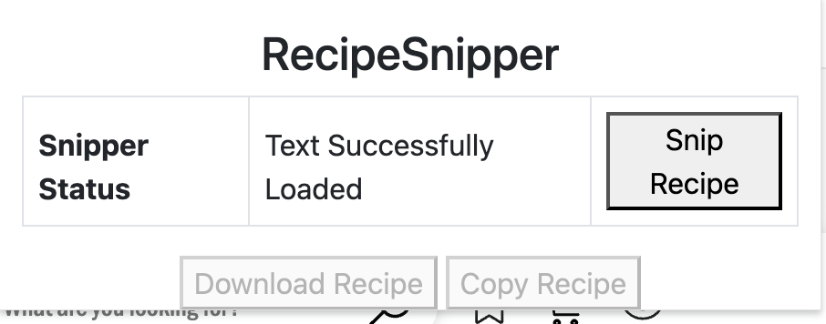
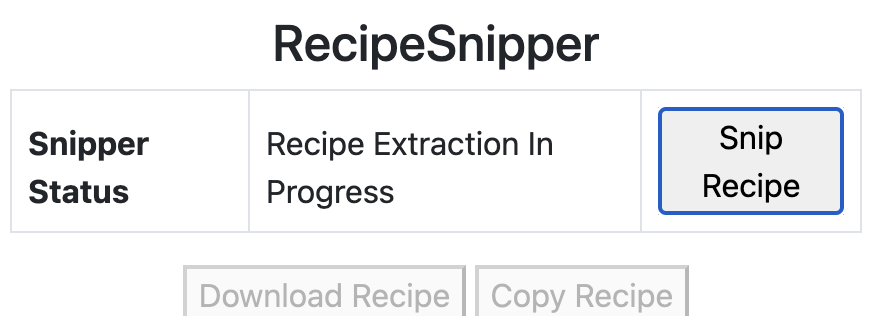
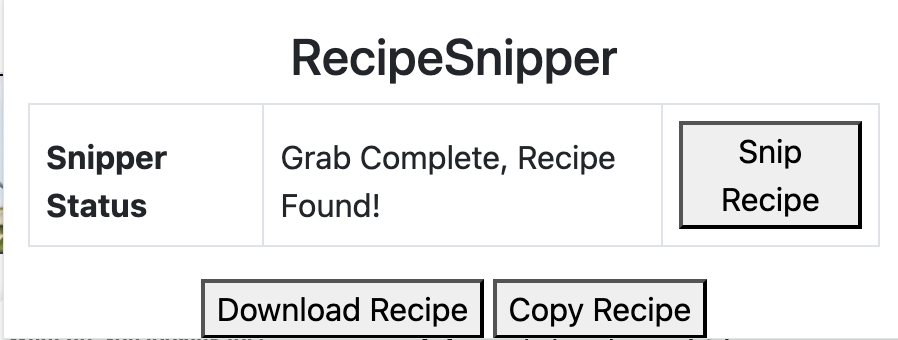
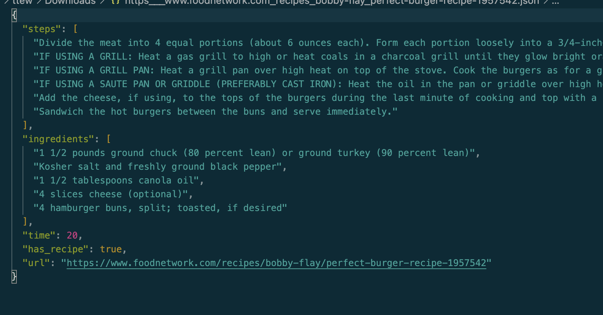

# RecipeSnipper Browser Extension Demo
The following is a demo for a browser extension that pulls down recipes from the current site and returns a formatted JSON file with the recipe metadata. 

Production backend is hosted on Heroku and powered by FastAPI

As for why I've built this service, I've run into issues with accessibility and cooking websites. Often, these pages are filled with ads and are difficult to navigate; many require an email being added to a mailing list to pull a copy of the recipe. 

Since I assume that others run into similar issues, I wanted to create a tool that I'd use to store recipes of interest in a way others may also benefit.

The hope here is to allow folks to collect recipes, share content easily over text/email, and build their own personal repositories without needing to save links that may or may not persist over time or deal with the other accessibility challenges described above.

### Running the Extension via Local Installation
- Open up Chrome, click on the puzzle piece for extension managemetn, and then click into manage extensions
- Switch the slider for dev mode to on
- Click "load unpacked"
- In the file selector, click the extension folder (which should have the manifest, popup.html, and script.js)
- You should now be able to see RecipeSnipper on your extensions menu
- I intend to publish this to the Chrome store to ease installation, but because it scrapes page content I must write a privacy policy before publishing.

### How does this work?
- A good number of websites use Yoast SEO's recipe template, which is more or less standardized, but not all sites use them
    - It'd turn out that they are not always used and when they are used, sometimes they are incorrectly configured.
- To get a more generalizable outcome, the API uses GPT 3.5-turbo with low temperature to perform extraction over the observed site text
    - As it would turn out, GPT is pretty good at creating structured data for this particular use case and this gives us a (somewhat) stable way to approach the problem when we may be dealing with websites using different HTML setups

### How to use the extension
- Open up a website with a recipe
 

- Click the "Snip Recipe" button and wait for loading to finish

- After a few seconds a "Recipe found" or "No recipe found message will show up"
    - If you found a recipe, the response will indicate that (likewise, you will get an error here if not)
    

    - Click the download button (or copy to clipboard) for a formatted .txt file of the recipe, you'll get content like this
    

### Requirements to Run API Locally
- Python 3.12 and libraries contained within requirements.txt
- OPENAI_API_TOKEN environment variable (can be set in .env file, bash_profile, or similar), set this before spinning up API locally

### Running the API Locally
- The actual browser extension runs off of a hosted API for all requests, but if you're testing locally, run the "run_server.sh" script or use the Python command from inside; note that you'll need your OPENAI_API_TOKEN set and correct virtualenv/dependencies set.
  
